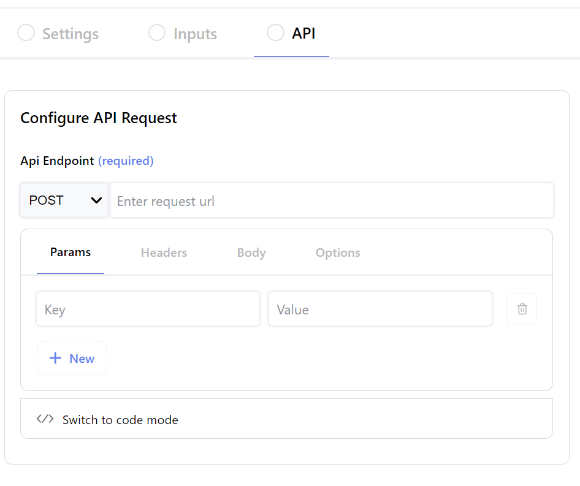
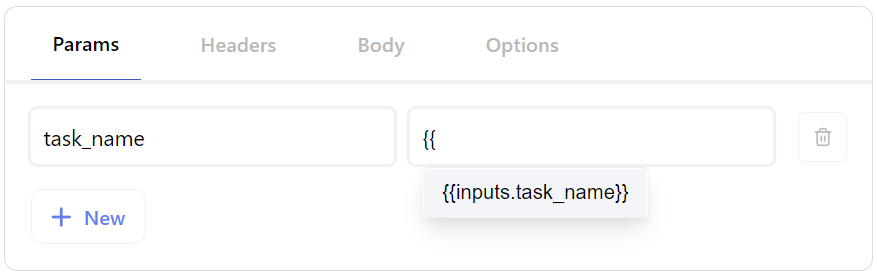

## < [Actions](./Actions.md.md) - Create/Update Action

---

## API

<br />

Allows you to configure the http request which will be made every time the action is executed.
<br />
<br />

### **Url Request Schema**

1. Select an http method from the dropdown (e.g. `POST`)
2. Enter a request url where Rollout should send requests to (e.g. `https://yourapi.com/action/create_task`)
3. Configure key value pairs for:
   - Params
   - Headers
   - Body (:information_source: Unavailable for `GET` | `HEAD` methods)
4. Configure options for:

   - Omitting empty parameters
   - Omitting empty body fields

<br />
<div align="center">
  
</div>
<div align="center">
  <sub><i>Configure the HTTP Request either via UI or Code Mode by clicking on the "Switch to code mode" toggle.</i></sub>
</div >

<br />

### Input variable referencing

In order to receive relevant user automation data, you will want to reference the available [`inputs`](../../api/perform-code-global-objects.md#inputs-object) variables which corelate to the existing configured [Inputs](./Actions-Inputs.md) tab.

<div align="center">
  
</div>
<div align="center">
  <sub><i>All available inputs are accessible via the <code>inputs</code> object. </i></sub>
</div >

### Code Mode

> :information_source: The first time code mode is saved, any current UI configurations will be parsed to code. Once saved, any subsequent switches from UI <> Code mode will not override any additional code changes you make. Likewise, any code updates made will not affect UI configuration settings.
> <br /><br />
> Whichever mode is saved takes precedence when actions are executed

It is also possible to configure your action's api configuration in code mode, granting a greater degree of control over each request. For example, if you require HMAC authentication against the configured endpoint, you'll want to set this up here.

A list of available execution context functions and variables can be found in the [Perform Global Objects](../../api/perform-code-global-objects.md) page.

<br />

HMAC Example:

```javascript
const url = "https://yourapi.com/action/create_task";

const { task_name, task_description } = inputs;

const body = JSON.stringify({
  task_name,
  task_description,
});

const hmacSignature = utils.crypto
  .createHmac("sha256", env.HMAC_SECRET)
  .update(body)
  .digest("hex");

const options = {
  headers: {
    "HMAC-Signature": hmacSignature,
    "Content-Type": "application/json",
  },
  body,
  method: "POST",
};

return await utils.fetch(url, options).then((res) => res.json());
```
