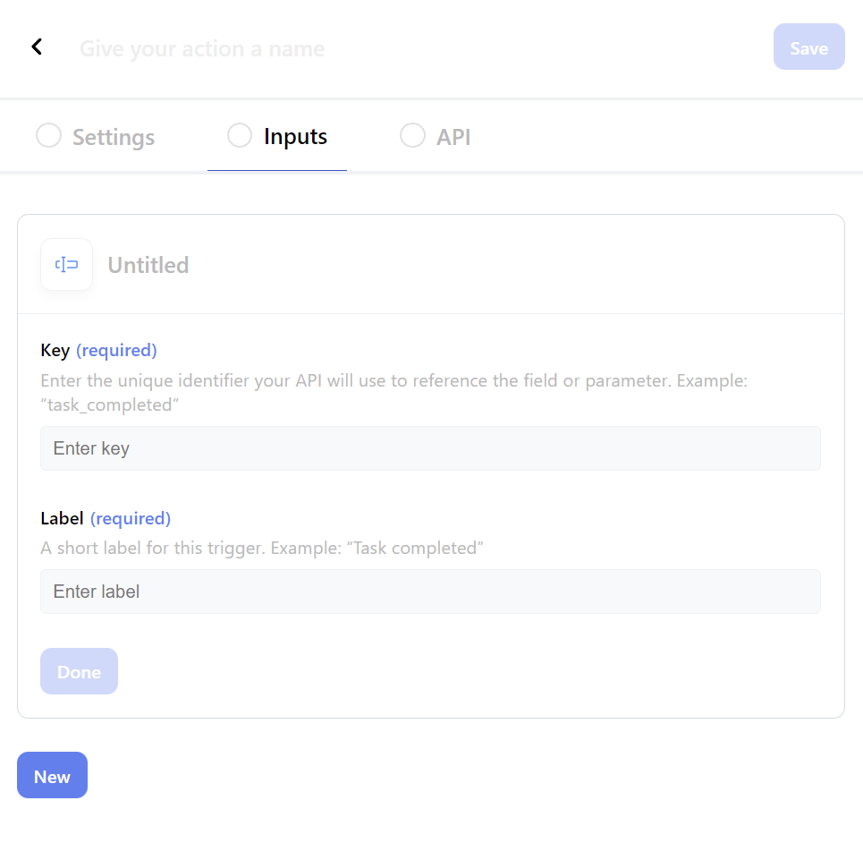

## < [Actions](./Actions.md) -  Create/Update Actions
---

## Inputs Tab

 

Allows you to configure the inputs which will be available to users when using the action on an automation.  

 

| label | required | unique | Description                                                               |
| ----- | -------- | ------ | ------------------------------------------------------------------------- |
| Key   | true     | true   | Unique identifier which your API will use to reference this field         |
| Label | true     |        | Label shown to user when selecting variable reference (via the `@` menu). |

 

  

 
