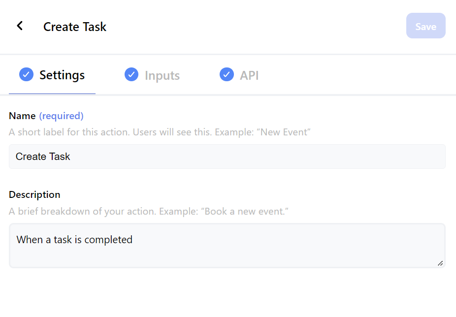

## < [Actions](./Actions.md) - Create/Update Action

---

## Settings

 

| label       | required | Description                                            |
| ----------- | -------- | ------------------------------------------------------ |
| Name        | true     | Label shown to users when selecting the action.        |
| Description |          | Description shown to users after selecting the action. |

 

  

