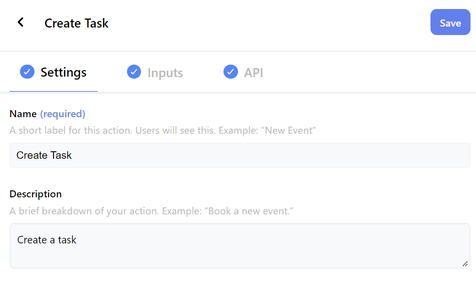

# < [Dashboard](../README.md) - Actions

This view allows you to create new or update existing actions for your app with the following tabs:

 

- [Settings](./Actions-Settings.md)
- [Inputs](./Actions-Inputs.md)
- [API](./Actions-Api.md)

 

  

