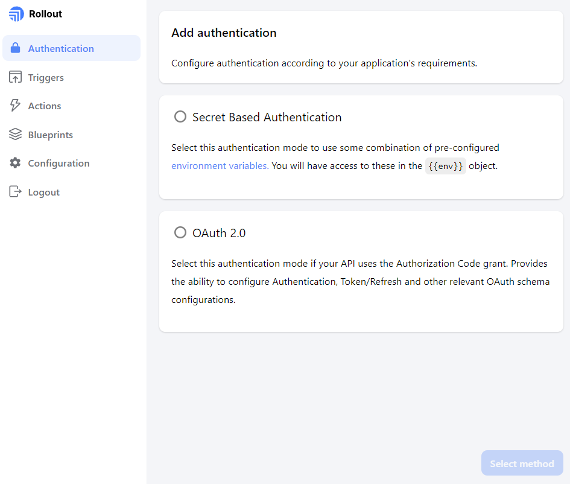

# < [Dashboard](../README.md) - Authentication

The Authentication view allows you to configure user authentication according to your app's requirement. 

Currently supported are:

- [OAuth 2.0](./OAuth2-0.md)
- [Secret Based Authentication](./SecretBasedAuthentication)

> Where relevant, user authentication information such as tokens can be accessed via the <code>{{context.authData}}</code> object

 

  

