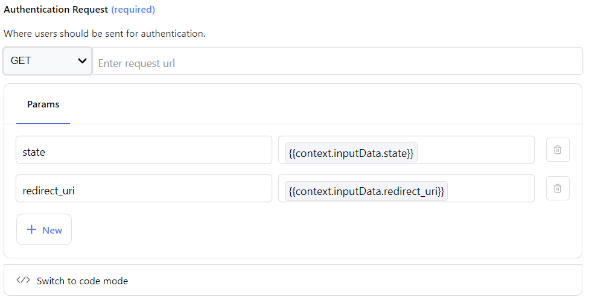
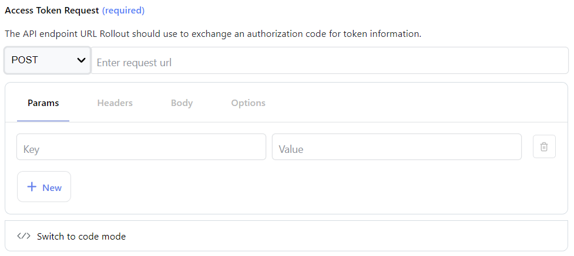

## < [Dashboard](../README.md) < [Authentication](./Authentication.md) - OAuth 2.0 (Authorization Code)

---

Allows you to configure an Authorization Code Grant flow, as specified in [RFC6749](https://datatracker.ietf.org/doc/html/rfc6749#section-1.3.1).  

The following url schemas / perform code blocks are available:

- [Authentication Request](#bauthentication-requestb)
- [Access Token Request](#baccess-token-requestb)
- [Refresh Token Request](#brefresh-token-requestb)

---

 

### <b>Authentication Request</b>

Configure the url where users will be sent to initiate the authentication flow.

In order for Rollout to successfully process the redirection, the following query parameter values are required:

| key                       | value                                           | required |
| ------------------------- | ----------------------------------------------- | -------- |
| `state`        | `{{context.inputData.state}}`        | true     |
| `redirect_uri` | `{{context.inputData.redirect_uri}}` | true     |

 

  

  <i>Users should be redirected to the <code>redirect_uri</code> address once authenticated, along with the original <code>state</code> and <code>code</code> values. </i>

 

Once a user authenticates successfully and the authorization server generates an exchange code, redirect them to the `redirect_uri` value with the `state` and `code` as query parameters.

> If using the `perform` code mode, the expected return value is a string.

 

### <b>Access Token Request</b>

Configure the URL schema which Rollout will use to exchange the `code` from the [Authentication Request](#bauthentication-requestb) for token information; the received object will be available from here on in future execution contexts (such as Resthook subscriptions, or action invocations) in the `{{context.authData}}` object.

 

  

  <i>Values returned from an access token request will be available in the <code>{{context.authData}}</code> object.</i>

 

### <b>Refresh Token Request</b>

This Schema will be used when retrieving fresh token information when existing tokens (e.g. `refresh_token`) are already present.

