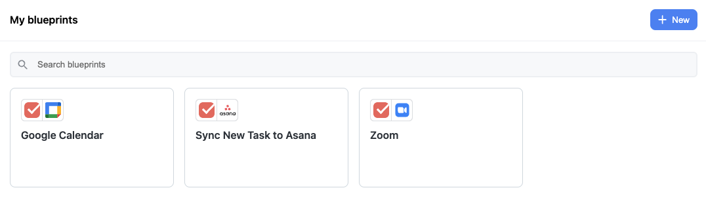
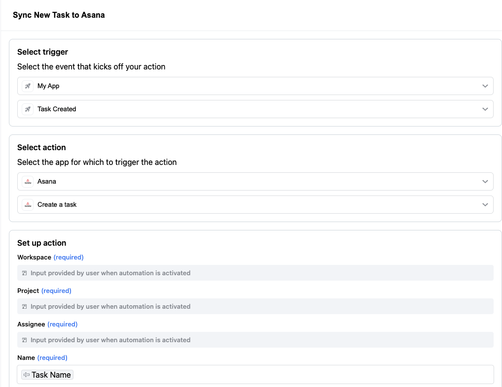
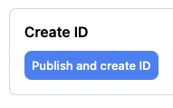
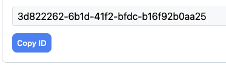

# < [Dashboard](../README.md) - Blueprints

The [Blueprints view](https://app.rollouthq.com/dashboard/blueprints) allows you to create and edit the Blueprints you offer your users.

 

  

 

Creating and editing a blueprint is very similar to the user experience of creating and editing automations through the embedded UI. You select the blueprint's trigger and action, and then specify the action inputs. The user will provide credentials for third-party apps and input any action inputs that depend on their credentials (e.g. when selecting a project, folder, or contact).

 

  

When you're ready to share a newly created blueprint, click "Publish and create ID" at the bottom of the Create Blueprint Page. You can then copy the Blueprints id for use in the Blueprint components or API.

 

  

  

