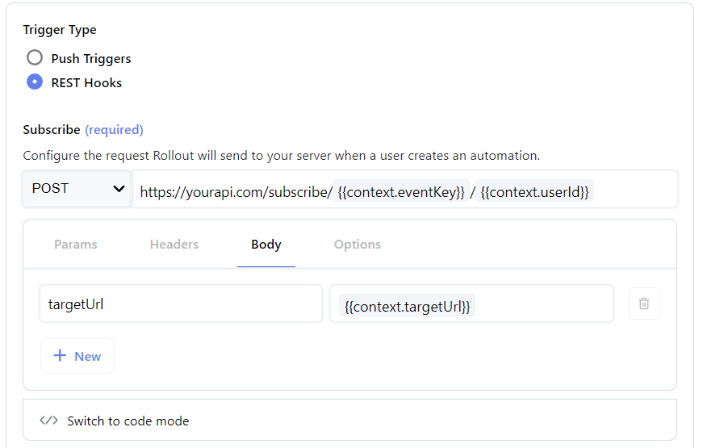

## < [Triggers](Triggers.md) - Create/Update Trigger
---
## Api Configuration

<br />

Allows you to configure your trigger to use either **Push Trigger** or **REST Hooks** patterns.
<p align="center">
  
</p>

### Push Trigger

A Push trigger requires no further configuration. You can read more on how to send trigger events in the [API > Send Trigger Event](../../api/TriggerEvents.md) section.

<p align="center">
  
</p>

### REST Hooks

The rest hook pattern allows you to configure **subscribe** and **unsubscribe** endpoints which we will send requests to each time an automation is created or deleted. More details on the pattern can be found [here](https://resthooks.org/).

Selecting this pattern will enable you to configure the following:

- Subscribe url request schema
- Unsubscribe url request schema
- Perform code

### **Url Request Schema**

### UI Mode
---
<br />

1. Select an http method from the dropdown (e.g. `POST`)
2. Enter a request url where Rollout should send requests to (e.g. `https://yourapi.com/subscribe`)
3. Configure key value pairs for:
   - Params
   - Headers
   - Body (:information_source: Unavailable for `GET` | `HEAD` methods)
4. Configure options for:
   - Omitting empty parameters
   - Omitting empty body fields

<br/>

<div align="center">
  
</div>
<div align="center">
  <sub><i>Variables can be accessed with the <code>{{</code> menu. Switching to code mode will expose greater configurability. </i></sub>
</div >

<br />

### Code Mode
---
<br />

It is also possible to configure your action's api configuration in code mode, granting a greater degree of control over each request. For example, if you require HMAC authentication against the configured endpoint, you'll want to set this up here. 

A list of available execution context functions and variables can be found in the [Perform Global Objects](../../api/PerformGlobalObjects.md) page.

> :information_source: The first time code mode is saved, any current UI configurations will be parsed to code. Once saved, any subsequent switches from UI <> Code mode will not override any additional code changes you make. Likewise, any code updates made will not affect UI configuration settings.
> <br /><br />
> Whichever mode is saved takes precedence when actions are executed

<br />


### **Perform**

The perform function is executed every time Rollout receives a webhook request, making it an ideal place to perform any mapping transformations or implementing custom logic. (e.g. HMAC authentication).

The following [Perform Global Objects](../../api/PerformGlobalObjects.md) are available when executing custom code:

- `utils`
- `context`
- `env`

You can find detailed info of what each object holds and backwards zapier compatibility [here](../../api/PerformGlobalObjects.md).

> Note: Return value of the perform function must be the first element of an array

Default:

```javascript
return [bundle.cleanedRequest];
```

Mapping:

```javascript
const { payload } = bundle.cleanedRequest;

const mappedPayload = {
  task_name: payload.task_name,
};

return [mappedPayload];
```

HMAC Authentication:

```javascript
const { hmac, public_key, payload } = bundle.cleanedRequest;

const hmacToCompare = utils.crypto
  .createHmac("sha256", env.HMAC_SECRET)
  .update(payload)
  .digest("hex");

if (hmacToCompare != hmac) {
  throw new Error("Unauthorized");
}

const mappedPayload = {
  task_name: payload.task_name,
};

return [mappedPayload];
```
